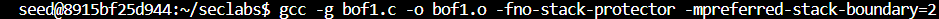
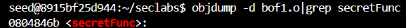
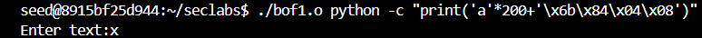
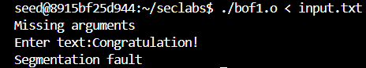
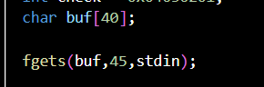
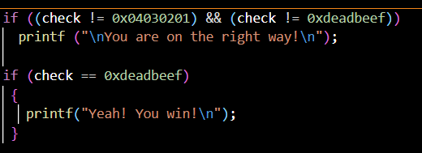
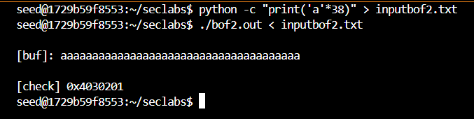
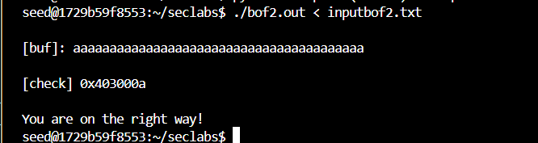
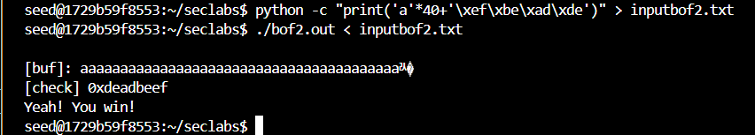

# Lab#1: Buffer Overflow

#Link to GitHub:https://github.com/DominateProbabilitywithconcent/InsecLabs

# Task 1: Stack smashing by memory overwritten

## 1.1. bof1.c 

This **bof1.c** program has an array of limitation of 200 characters in the 'vuln' function.  
 In order to deploy the buffer overflow attack, we need an input that contains **204** characters (200 for buffer and 4 to spill the ebp register) with the address of **'secretFunc'** function. 
 First, compile the source code of the program bof1.c into bof1.o with these two flag **"-fno-stack-protector"** and **"-fno-stack-protector -mpreferred-stack-boundary=2"** . 
   
 Then, find the address of 'secretFunc' function by using 'objdump' command.  
 
The program itself requires we type (gets function) and it will either refuse typing command or perceive the command as string. 
 
->>***Program perceives the command as a string and makes the command useless*** 

So we have to bind the input into the file named 'input.txt'.  
  
Finally, we inject the input from 'input.txt' into the program and wait for result. 
  
->>***The terminal showing the 'Congratulation!' line from the 'secretFunc' function which means this method worked***

## 1.2. bof2.c
In order to hack this program, we need to see its vulnerabilities first: 
 - The __'fgets'__ function reads up to 45 characters, but the __'buf'__ variable size is only 40 bytes. This creates a buffer overflow opportunity. 
  
 - The __'check'__ variable is compared to user-controlled input. It can be used to control the program behaviour. 
  

 First, compile the bof2.c into bof2.out. 
 Then, create a new file named "inputbof2.txt" which contains the input that will be used. 
 Test if the program runs normally. 
   

 The size of input is smaller than the buffer(40) so there is no overflowing problem and value of check is still as default. 

 Then we increase value of the input into 40. 
  
 The value of 'check' variable is now __0x403000a__ which triggers __'You are on the right way!"__ message. 
 Last part, we just need to input 40 characters again but this time we add the return address __0xdeadbeef__
  

## 1.3. bof3.c

# Task 2: Code Injection

## 2.1. Preparing shell code

## 2.2. Preparing the payload

## 2.3. Code injection