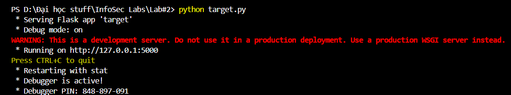

# Link to GitHub: https://github.com/DominateProbabilitywithconcent/InsecLabs/tree/main
# Task 1: normal transaction with CRSF vulnerability
 
 Firstly, start the terminal in the folder where locates these 2 files. 
  
 Then, running __python target.py__ command on the terminal. 
  
 In the terminal, it will show the address of the transaction website, which is http://127.0.0.1:5000. We will access to this website using Microsoft Edge. 
  

## 1.1: Login, Check balance
 
 Access to login screen through __/login__ url. 
  
Check account username and password in the program. It show Alice's username and password which is __'alice'__. 
 
 Login as Alice. 
  
  
Divert url to __/balance__ and check balance. 
 
## 1.2: Doing the transaction
Divert to transaction page via __/transfer__ url. 
 
Transfer 1234$ to Bob account. 
 
Notifcation that transaction is successful. 
 
Check Alice's balance. 
 
Log out. 
 
Chcek Bob's balance. 
 
 
## 1.3: Tranfer money illegitimately
Activate the __hidden_form.html__. 
 
Result: The current login account which is Alice got hacked. The html code automatically ran the moment user open the __hidden_form.html__. 
 
Check Alice's balance. 
 

# Task 2: CSRF Countermeasure implementation

## 2.1: Solution 1:
### __CSRF Token__

 First, we import __flask_wtf__ to handle CSRF token and __os__ for creating random byte string of 32 bytes (256 bits). 
 
These strings are unpredictable enough while tieing with user's session. Potential candidates as a secret key  
 
 Then, Add __<input type="hidden" name="csrf_token" value="{{ csrf_token() }}">__ into the html part of __transfer__ function to start deploying. 
 
Result when trying to attack via hideen_form.html file: 
 
 

## 2.2: Solution 2: