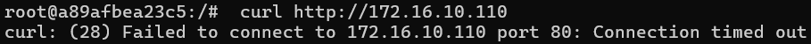

# Link to GitHub: https://github.com/DominateProbabilitywithconcent/InsecLabs/tree/main

# Lab FireWall submission.

# A. Setup rules on router to block all access into it except __ping__.

 Open cmd and use command __docker ps__ to view all currently running docker container.<br> <br>
  <br>
 Access to ***router*** container. This is where most of the modification will happen.<br>
 Command used:
 ```sh
    docker exec -it router /bin/bash
 ```
 Flush all previously setup rules in the router then check router rules.<br>
 Command used:
 ```sh
    iptables -F #Delete all rules except user-defined
    iptables -X #Delete all user-defined rules
    iptables -S # Check rules and their order on router.
 ```

  <br>
  Usually, we will need to use command:
  ```sh
  iptables -P INPUT DROP
  ```
  in order to change default setting into blocking any incoming packets. But as you can see, the INPUT rules already set from **ACCEPT** to **DROP**, made this command uneccessary. But if the default **INPUT** rules are set to **ACCEPT**, this command will deem useful.<br><br>
  ***NOTES***: Make sure the to get *-P INPUT DROP* at the top on the rules list as the system prioritizes these rules in descending order from top to bottom.
  Next, Use command to set Allow ping traffic rule:
  ```sh
  iptables -A INPUT -p icmp --icmp-type echo-request -j ACCEPT
  ```
 This command allows incoming ICMP echo requests or ping to be accepted by the firewall.<br>
 Check the rules currently on the router.<br>
 <Br>
 ### Result:
 Access to ***outsider*** virtual computer.<br>
  ```sh
    docker exec -it outsider-10.9.0.5 /bin/bash
 ```
 1. Try ping to router.
 ```sh
     ping 10.9.0.254
 ```
 <br>
 => Ping traffic still works.<br>

 2. Try telnet to router.
 ```sh
    telnet 10.9.0.254
 ```
 <br>
 => Block the access to router from outsider computer.<br>
 3. Try curl to router.
   ```sh
    curl http://10.9.0.254
 ```
  <br>
 => Also blocked.<br>

# B. Setup rules on router to prevent computers on subnet 10.9.0.0/24 from accessing the internal web server (iweb)
 Set more rules to prevent htttps, https port from computers on subnet 10.9.0.0/24.<br>
 Command used on router:
 ```sh
    iptables -A FORWARD -s 10.9.0.0/24 -d 172.16.10.110 -p tcp --dport 80 -j DROP #block http port (80)
    iptables -A FORWARD -s 10.9.0.0/24 -d 172.16.10.110 -p tcp --dport 443 -j DROP #block https port (443)
 ```
 ### Result:
Access to ***outsider*** virtual computer.<br>
  ```sh
    docker exec -it outsider-10.9.0.5 /bin/bash
 ```
 Try curl to iweb.<br>
 ```sh 
 curl http://127.16.10.110 
 ```
  <br>
  => Access is blocked.
# C. Setup rules on router to stop computers on subnet 172.16.10.0/24 from accessing the badsite.
Set more rules to prevent htttps, https port from computers on subnet 172.16.10.0/24.<br>
 Command used on router:
 ```sh
    iptables -A FORWARD -s 127.16.10.0/24 -d 10.9.0.10 -p tcp --dport 80 -j DROP #block http port (80)
    iptables -A FORWARD -s 127.16.10.0/24 -d 10.9.0.10 -p tcp --dport 443 -j DROP #block https port (443)
 ```
 ### Result:
 Access to ***inner*** virtual computer.
  ```sh
     docker exec -it inner-172.16.10.100 /bin/bash
 ```
 Try curl to get html file from badsite 10.9.0.10.<br>
 <br>
 => Access is blocked.<br>

